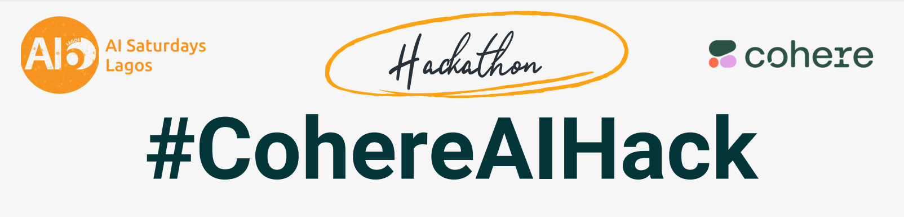

#AI6 Lagos: Cohere Hackathon

Cohere allows you to implement language AI into your product. This repo contains some sample scripts from working with [cohere's APIs](https://dashboard.cohere.ai/) for the following tasks:

- [Generate Promotion Post](https://dashboard.cohere.ai/playground/generate) - [script]()
- [Customer Support](https://docs.cohere.com/reference/customer-support) - [script]() 
- [Co.Summarize Tweet](https://docs.cohere.com/docs/summarize) - [script]()
- [Toxicity Detection]() - [script]()
- [Language Detection](https://docs.cohere.com/docs/language-detection) - [script]()
- [Playing with Embedding vectors]() - [script]() 

## Reference 
- [Dummies Guide: Getting Started with Cohere]( https://twitter.com/MobilePunch/status/1654003871935545344)
- [Cohere Python SDK Release 4.3.1](https://cohere-sdk.readthedocs.io/_/downloads/en/latest/pdf/)
- [Cohere Notebook](https://github.com/cohere-ai/notebooks/tree/main/notebooks)